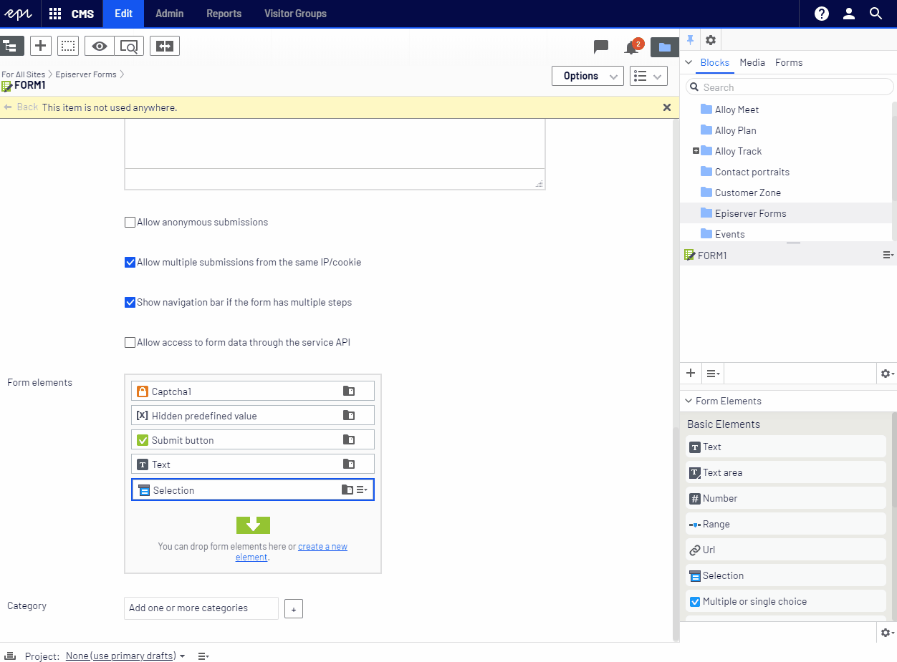

# Advanced Forms

> ⚠ WARNING: This package is no longer maintained.
> Episerver CMS UI 11.34.0 has built-in support for Quick Edit command
> Download it from https://nuget.episerver.com/package/?id=EPiServer.CMS.UI.Core&v=11.34.0
> Please uninstall this package as it will be removed from the feed at some point

Episerver 11+ extension that enhances the Forms editing experience.

Editor is now able to edit every form inline, without the need to switch the editing context.
Just double click any `Form Element` to edit its properties.




## Configuring enabled features

To turn off one or more feature, use the `AdvancedCMSFormsOptions` options class and then, for example, in the initialization module, set `false` on the feature that should not be available. All features are enabled by default. 
 
```csharp
[InitializableModule]
public class CustomFormsModule : IInitializableHttpModule
{
    public void Initialize(InitializationEngine context)
    {
        var options = ServiceLocator.Current.GetInstance<AdvancedCMSFormsOptions>();
        options.InlineEditing = false;
        options.InlinePublish = false;
    }

    public void Uninitialize(InitializationEngine context)  {  }

    public void InitializeHttpEvents(HttpApplication application) {  }
}
 ```

## Install

```Install-Package Advanced.CMS.Forms```

https://nuget.episerver.com/package/?id=Advanced.CMS.Forms
